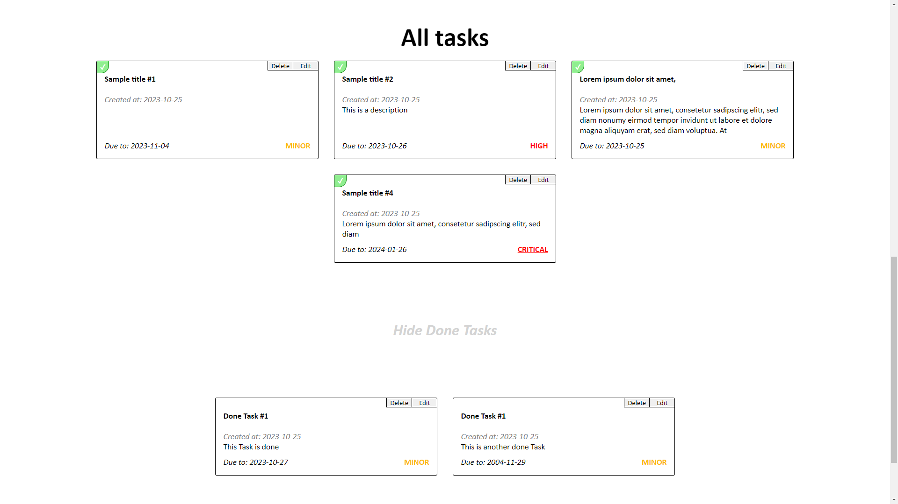
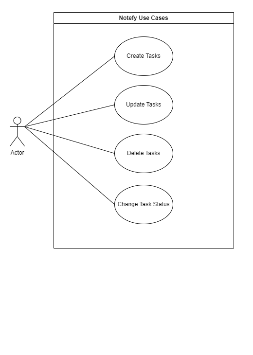
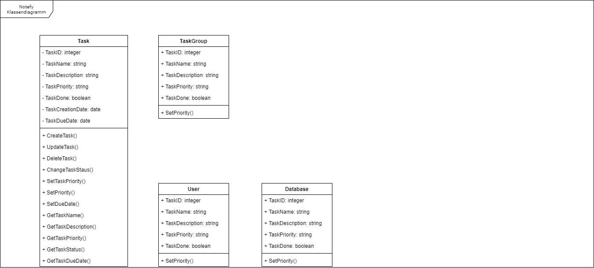
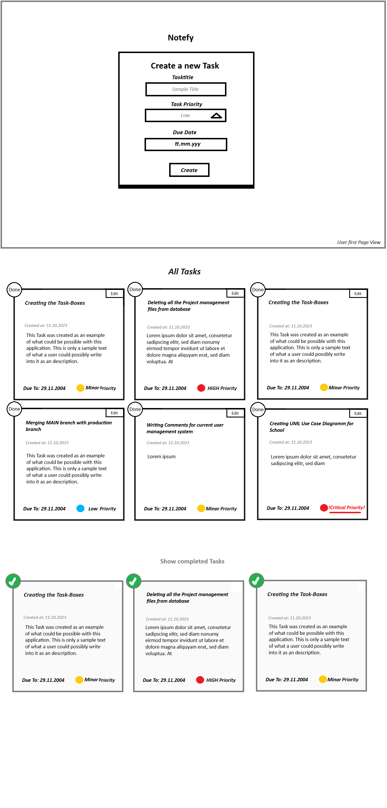
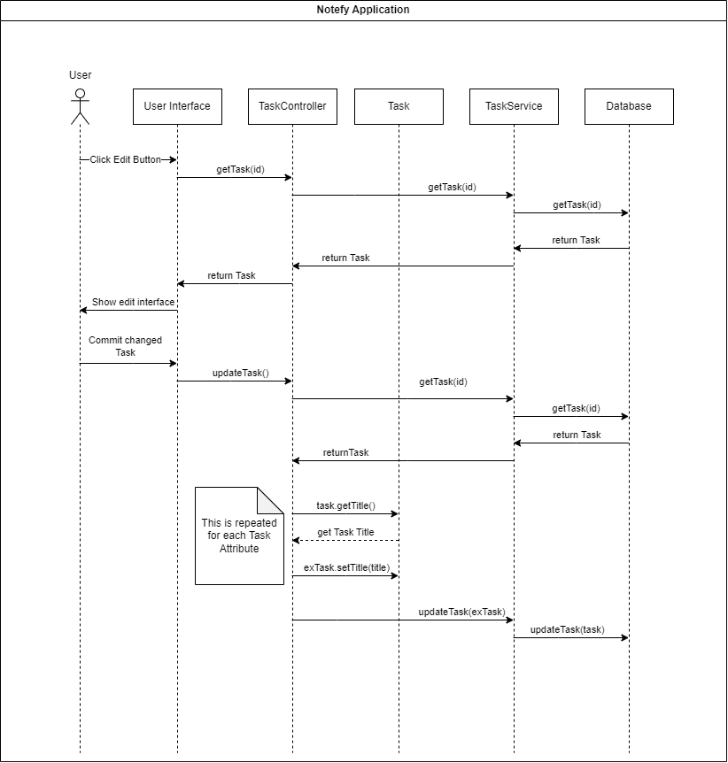

# Notefy

Notefy is a student project that aims to make the creation and management of tasks easier and more efficient.   
We are two students of the [technical School Zurich(tbz)](https://tbz.ch/) that are working on creating this Java/PHP Application.  
In this ReadMe we will quickly explain how our application works.

1. [Introduction](#introduction)
2. [Backend](#backend)
    - [Testing](#testing)
3. [Frontend](#frontend)
4. [Diagrams and planning](#diagrams-and-planning)
    - [Application use cases](#application-use-cases)
    - [Class Diagram](#class-diagram)
    - [Mockup for the GUI](#mockup-for-the-gui)
    - [Sequence Diagram](#sequence-diagram)

## Introduction
As mentioned before; This is a student project that is being realized in less than 10 Weeks. Our goal was to create a functional application to create and manage tasks.   
The Application is separated into two parts. 
1. API
2. Frontend

The API represents the backend of our application. It manages the data and creates, deletes and updates the tasks. It is also responsible to write and retrieve the data from the Database. Furthermore, it is fully written in Java and Java Springboot and uses the JDK version 20.
 
The Frontend accesses the functions from the API. Is is written with the help of plain HTML, CSS, JavaScript and PHP.  While all the data is managed in the API, the frontend is for the User to create the Tasks.

## Backend

### Classes

The Backend consists of three necessary classes which all of them contribute towards getting and sending Objects from our Database
to our Frontend in this section the classes will be explained in further detail. Let's begin.

#### Task.java

Our first class is gonna be the Task class. Here we define what our Task Object looks like and what kind of data should be inside one of our Task
Objects. The Task Object consist of seven different attributes.
- id; Long
- title; String
- priority; PriorityType
- done; boolean
- createDate; LocalDate
- dueDate; LocalDate
- description; String

These seven attributes define how our Task Objects look like in this class are three different constructures that
write data to the Task Class. First we have a default constructor that is needed to start the application by default.
Second a constructor without the assigning of an id to the Object. That is because we use this constructor in a further chapter to update a Task Object.
And last we have the third constructor used to create new Task objects which are not yet existing in our Database.

Next to all those things we have for every field a getter and setter, which are used to well as the name already says get and set different attributes in our Task Object.
Last there is one method used the .toString() Method used to convert the Object to a string if needed.

#### TaskController.java

This were the Frontend talks with the Database indirectly. In the TaskController are five different Methods that are used to implement simple CRUD
functions. 

- getTasks(); Used to return all the Tasks currently stored in the DB
- getTask(Long id); Used to return one Task specifically
- newTask(Task task); Used to create a new Task on the DB
- updateTask(Long id, Task task); Used to get existing Task on DB and replace field data with the incoming Task Object
- deleteTask(Long id); Used to delete the Task with the provided Id

All of these methods talk not directly with the Database but rather with our next deeper Layer, our TaskService.

#### TaskService.java

Here we speak directly with our Database the TaskService implements an Interface named TaskRepository which in turn
also implements an Interface named JPARepository. This Repository was not created by us but implemented by a maven dependency.
The methods inside of TaskService look the same as the ones in TaskController with the difference that all the logic actually happens
inside our TaskController and the service only is used for sending and receiving the data from our Database

### Testing
Of course we have to test our application. We found that the best way to test the application is to write a testprotokoll alongside the Unit Tests. 

| Test Name              | Test purpose                             | Expected result                  | Actual result           | Test Status |
|------------------------|------------------------------------------|----------------------------------|-------------------------| ----------- |
| testGetTasks           | Get List of Task                         | List of Tasks                    | List of Tasks           | OK |
| testGetTask            | Get Single Task                          | Single Task Object               | Single Task Object      | OK |
|                        | Check for ID                             | 1L                               | 1L                      | OK |
| testGetTaskNotFound    | Throw Error when object not existent     | ResponseStatusException          | ResponseStatusException | OK |
| testNewTask            | Create new Task                          | New Task ID found                | New Task ID found       | OK |
| testUpdateTask         | Update a Task                            | Check for if fields were updated | Fields were updated     | OK |
| testUpdateTaskNotFound | Throw error when Task ID does not exists | ResponseStatusException          | ResponseStausException  | OK |
| testDeleteTask         | Delete Task                              | Given ID deleted                 | ID deleted              | OK |
| testDeleteTaskNotFound | Throw error when ID does not exists      | ResponseStatusException          | ResponseStatusException | OK |

## Frontend
Like mentioned above, is the Frontend responsible for the handling of the passed Data. 
All of the functions provided in the Frontend can be accessed by the landing page. The User does not need to navigate through a long list of links to get what he wants.   
Here is an overview of how the Frontend looks like:  

Here we can see what the user sees the first time he enters the website.

And here we can see what the tasks look like.  
Everything the User needs can be seen by one quick look at the task Box. 

## Diagrams and planning
#### Application use cases

#### Class Diagram

#### Mockup for the GUI

#### Sequence Diagram
