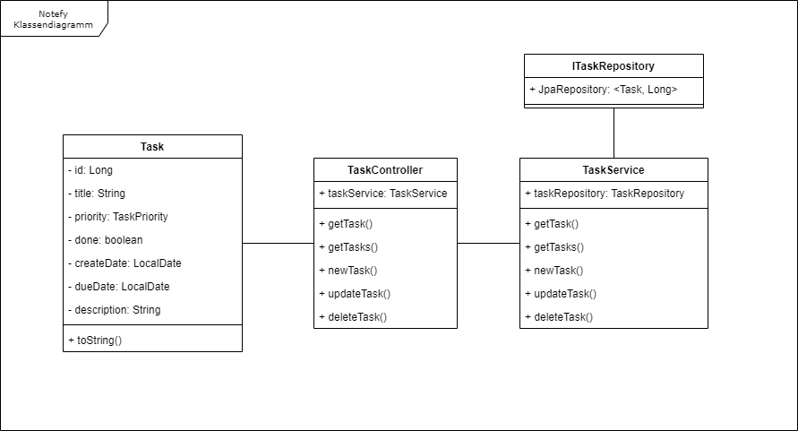

# Notefy

Notefy is a student project that aims to make the creation and management of tasks easier and more efficient.   
We are two students of the [technical School Zurich(tbz)](https://tbz.ch/) that are working on creating this Java/PHP Application.  
In this ReadMe we will quickly explain how our application works.

1. [Introduction](#introduction)
2. [Backend](#backend)
    - [Sample Title 1](#sample-title-1)
3. [Frontend](#frontend)
4. [Diagrams and planning](#diagrams-and-planning)
    - [Application use cases](#application-use-cases)
    - [Class Diagram](#class-diagram)
    - [Mockup for the GUI](#mockup-for-the-gui)
    - [Sequence Diagram](#sequence-diagram)

## Introduction
As mentioned before; This is a student project that is being realized in less than 10 Weeks. Our goal was to create a functional application to create and manage tasks.   
The Application is separated into two parts. 
1. API
2. Frontend

The API represents the backend of our application. It manages the data and creates, deletes and updates the tasks. It is also responsible to write and retrieve the data from the Database. Furthermore, it is fully written in Java and uses the JDK version 20.
 
The Frontend accesses the functions from the API. Is is written with the help of plain HTML, CSS, JavaScript and PHP.  While all the data is managed in the API, the frontend is for the User to create the Tasks.

## Backend

### Testing
Of course we have to test our application. We found that the best way to test the application is to write a testprotokoll alongside the Unit Tests. 

| Test Name  | Test purpose | Expected result | Actual result | Test Status |
| ------------- | ------------- | ------------- | ------------- | ------------- |
| testGetTasks  | Get List of Task  | List of Tasks | List of Tasks | OK |
|   | Throw error when list empty  | IOException | Test Error | NOK |
| testGetTask  | Get Single Task  | Single Task Object | Single Task Object | OK |
|   | Check for ID | 1L | 1L | OK |
|   | Throw Error when object not existent | IOException | Test Error | NOK |
| testNewTask  | Create new Task | New Task ID found | NaN | NOK |
|   | Throw error when Id already in Use | IOException | NaN | NOK |
| testUpdateTask  | Update a Task | Field updated (title) | NaN | NOK |
|   | Throw error when ID does not exists | IOException | NaN | NOK |
| testDeleteTask  | Delete Task | Given ID deleted | NaN | NOK |
|   | Throw error when ID does not exists | IOException | NaN | NOK |

## Frontend
Like mentioned above, is the Frontend responsible for the handling of the passed Data. 
All of the functions provided in the Frontend can be accessed by the landing page. The User does not need to navigate through a long list of links to get what he wants.   
Here is an overview of how the Frontend looks like:  

Here we can see what the user sees the first time he enters the website.

And here we can see what the tasks look like.  
Everything the User needs can be seen by one quick look at the task Box. 

## Diagrams and planning
#### Application use cases

#### Class Diagram

#### Mockup for the GUI

#### Sequence Diagram
